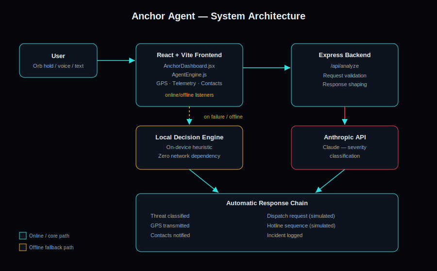

# 🛟 Anchor Agent

<p align="center">
  
</p>

<p align="center">

AI-Powered Real-Time Emergency Response System

Built for the AMD Developer Challenge / lablab.ai Hackathon by CR Tech Solutions.

</p>

---

# 🚨 Problem

In emergencies, seconds matter.

Most safety applications assume that users have enough time to unlock their phone, open an application, navigate menus and explain what is happening.

In real-life dangerous situations such as:

- Gender-based violence
- Home invasions
- Medical emergencies
- Car hijackings
- Assaults
- Kidnappings

users often have only seconds to react.

Internet connectivity can also become unreliable during emergencies, causing many cloud-based safety applications to fail exactly when they are needed most.

---

# 💡 Solution

Anchor Agent is an AI-powered emergency response system that turns a dangerous situation into a single action.

Users can:

- Hold the emergency orb
- Speak a distress command
- Trigger emergency workflows instantly

Anchor Agent then:

1. Classifies the threat severity using AI
2. Activates offline fallback if internet is unavailable
3. Logs telemetry data
4. Retrieves GPS location
5. Notifies emergency contacts
6. Initiates emergency response simulations

The system is designed to continue functioning even when connectivity is lost.

---

# ✨ Features

## 🚨 Emergency Orb Trigger

Press and hold for 3 seconds to activate emergency mode.

---

## 🎤 Voice Activation

Trigger emergencies through speech commands.

Examples:

- "Help me"
- "Someone is following me"
- "I am in danger"

---

## 🧠 AI Threat Classification

Anchor Agent uses Fireworks AI to determine:

- LOW
- MODERATE
- HIGH
- CRITICAL

severity levels and automatically decide what actions should be executed.

---

## 🌐 Offline First Architecture

If internet connectivity is lost:

- Local decision engine takes over
- Emergency workflows continue functioning
- Incident data remains available

This is one of Anchor Agent's core differentiators.

---

## 📍 GPS Monitoring

Obtains:

- Current coordinates
- Accuracy information
- Last known location

for emergency response workflows.

---

## 👥 Emergency Contacts

Users can store trusted contacts locally.

During emergencies Anchor Agent can automatically trigger notification workflows.

---

## 📡 Live Telemetry Feed

Real-time logs show:

- AI decisions
- GPS events
- Network state
- Triggered actions
- Emergency workflows

creating a mission-control style dashboard.

---

# 🏗 Architecture

<p align="center">
  
</p>

---

# 🔄 System Flow

```text
User
 ↓
Emergency Orb / Voice Input
 ↓
Agent Engine
 ↓
Decision Engine
 ↓
Fireworks AI
 ↓
Emergency Action Executor
 ↓
GPS + Contacts + Telemetry
```

---

# 🌐 Offline Flow

```text
Internet Failure
        ↓
Offline Detection
        ↓
Local AI Classifier
        ↓
Emergency Actions Continue
```

---

# 🛠 Tech Stack

| Layer | Technology |
|--------|-------------|
| Frontend | React |
| Build Tool | Vite |
| Backend | Node.js |
| API Server | Express |
| AI | Fireworks AI |
| Voice Recognition | Web Speech API |
| Geolocation | Browser Geolocation API |
| Storage | localStorage |
| Styling | Custom CSS |
| Deployment | Vercel + Render |
| Containerization | Docker |

---

# 📸 Screenshots

## Dashboard


---

## Emergency Activated


---

## Contacts Management


---

## Mobile View


---

# 🚀 Local Development

## Clone Repository

```bash
git clone https://github.com/YOUR_USERNAME/anchor-agent.git

cd AnchorAgent_Hackathon
```

---

## Install Frontend Dependencies

```bash
npm install
```

---

## Install Backend Dependencies

```bash
cd server

npm install
```

---

## Environment Variables

Create:

```text
server/.env
```

Add:

```env
FIREWORKS_API_KEY=YOUR_API_KEY
PORT=5000
```

---

## Start Backend

```bash
cd server

node index.js
```

---

## Start Frontend

```bash
npm run dev
```

Application:

```text
Frontend:
http://localhost:5173

Backend:
http://localhost:5000
```

---

# 🐳 Docker

Run the entire system:

```bash
docker compose up --build
```

---

# 🌍 Deployment

## Frontend

Deploy using:

- Vercel

---

## Backend

Deploy using:

- Render
- Railway

---

# 🔒 Privacy & Safety

Anchor Agent stores emergency contacts locally.

No personal information is sold or shared.

Emergency calling workflows shown in demonstrations are simulated and intended for prototype purposes.

---

# 🎯 Hackathon Highlights

✅ AI Powered Emergency Response

✅ Offline-First Architecture

✅ Real-Time Telemetry Dashboard

✅ Voice Activation

✅ Emergency Contact Workflows

✅ GPS Integration

✅ Mobile Responsive Interface

✅ Dockerized Deployment

---

# 👩‍💻 Team

## Charity Mapfudza

Founder — CR Tech Solutions

Roles:

- System Architecture
- Frontend Development
- AI Integration
- Emergency Workflow Design
- Deployment
- UX/UI Design

---

# 🏢 Organization

CR Tech Solutions

**Innovate • Code • Transform**

---

# 📜 License

MIT License

---

# ❤️ Built For

AMD Developer Challenge  
lablab.ai Hackathon  
2026